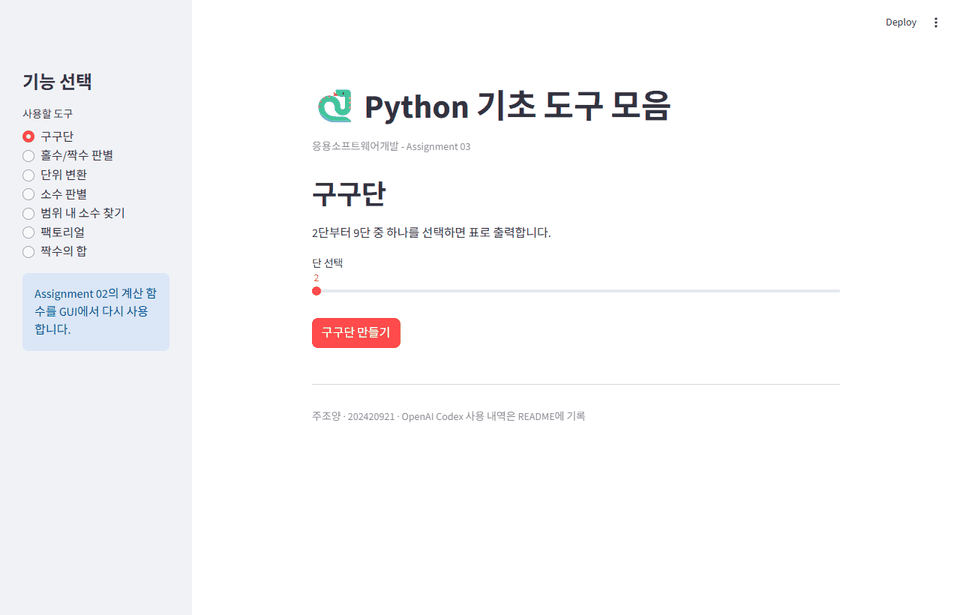

# Assignment 03 - Streamlit GUI Application

## 과제 목표

Assignment 02에서 만든 일곱 개의 파이썬 프로그램을 Streamlit GUI로
통합했습니다. 사용자는 터미널 명령 대신 웹 페이지의 메뉴, 입력창과
버튼을 이용해 각 기능을 실행할 수 있습니다.

## 주요 학습 내용

- `import`: 다른 파일에 작성한 함수를 불러와 재사용합니다.
- 함수 호출: GUI에서 입력받은 값을 `hw02` 함수에 전달합니다.
- `if` 문: 버튼을 눌렀을 때만 계산을 수행합니다.
- 딕셔너리: 메뉴 이름과 실행할 함수를 연결합니다.
- 예외 처리: 시작 값이 끝 값보다 큰 경우 오류 메시지를 표시합니다.
- Streamlit 위젯: `radio`, `slider`, `number_input`, `selectbox`, `button`을
  사용합니다.

## 파일 구조

```text
hw03/
├── README.md
├── app.py
├── demo.gif
├── requirements.txt
└── test_app.py
```

`app.py`에는 화면 코드가 있고, 실제 계산은 검증된 `hw02` 함수가
담당합니다. 이를 통해 계산 코드와 화면 코드를 분리했습니다.

## 설치 및 실행

저장소 최상위 폴더에서 다음 명령을 실행합니다.

```bash
python -m pip install -r hw03/requirements.txt
streamlit run hw03/app.py
```

브라우저에서 앱이 열린 뒤 왼쪽 메뉴에서 원하는 기능을 선택합니다.
서버를 종료하려면 실행 중인 터미널에서 `Ctrl+C`를 누릅니다.

## 자동 테스트

```bash
python -m unittest discover -s hw03 -p "test_*.py" -v
```

테스트는 일곱 개 메뉴가 오류 없이 열리는지, 홀수 판별 결과가 올바른지,
잘못된 소수 범위에 오류 메시지가 표시되는지 확인합니다.

## 실행 화면



## AI 사용 기록

- 사용 도구: OpenAI Codex
- 사용 목적: Streamlit 구조 설명, GUI 구현, `hw02` 함수 재사용,
  입력 검증, 자동 테스트, 문서 및 데모 작성
- 사용 프롬프트: "Assignment 03을 시작하기 전에 GUI, Streamlit,
  import, 입력 위젯과 requirements.txt를 초보자 수준으로 설명하고,
  확인 후 Assignment 02의 모든 기능을 GUI 프로그램으로 구현해 주세요."
- 생성된 코드는 자동 테스트와 브라우저 실행을 통해 검증합니다.
